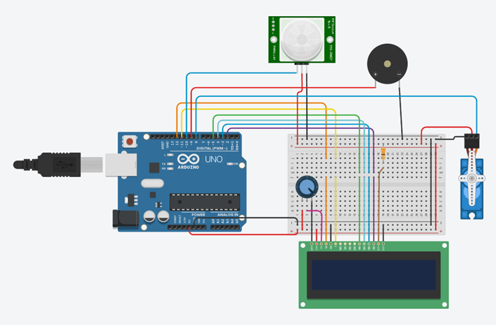

# TP Nro 2 Arquitectura De Computadoras

* Asignatura: Arquitectura de Computadoras
* Carrera: Ingeniería en Sistemas de Información
* Profesor: Ing. Juan de Dios Benitez

## Descripción

El propósito de este proyecto es asociar la teoría (codificación en binario BDC, buffer, CD4511 y transistores) con la práctica.

## Primer Proyecto Requerido para el TP (Visualizador Digital)

### Esquema del Circuito

### Estructura en UML (Diagrama de Clases)

### Código Visualizador Digital

[_> visualizador](codigos/visualizador_digital.ino)

## Segundo Proyecto Requerido para el TP (Visualizador Digital)

### Esquema del Circuito

### Código Sistema Para Garaje

[_> sistema para garaje](codigos/sistema_garaje.ino)

## Lenguaje

* C++ - Arduino

## Autor

* José Fernando Usui

